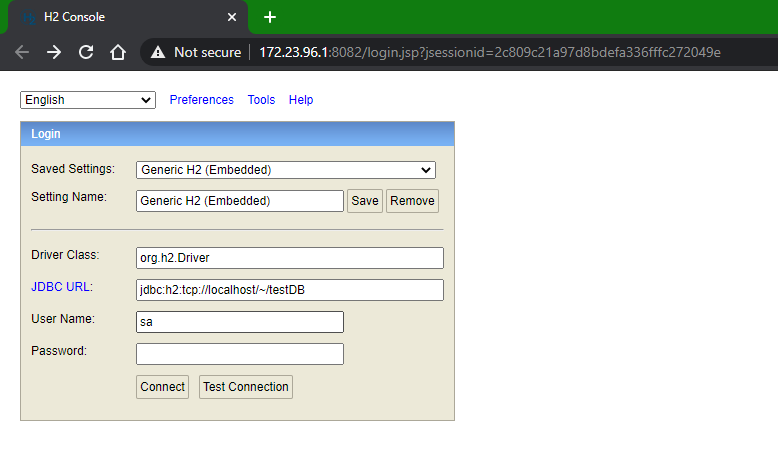
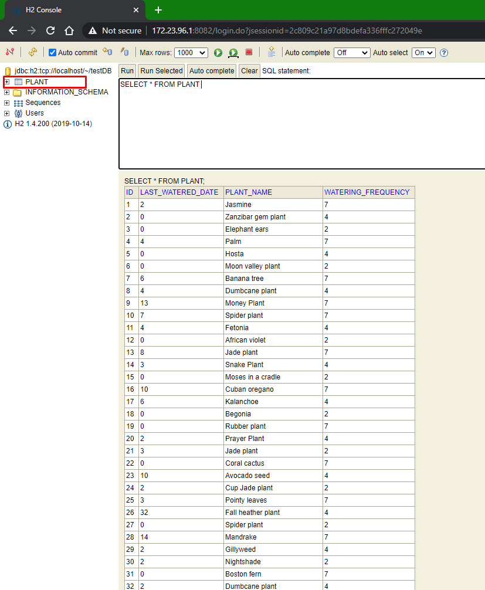
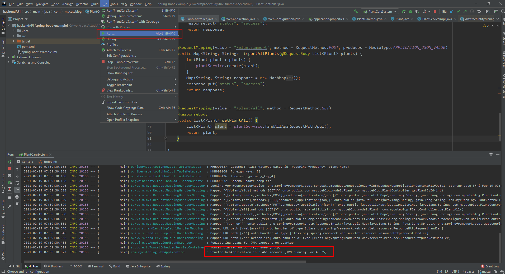
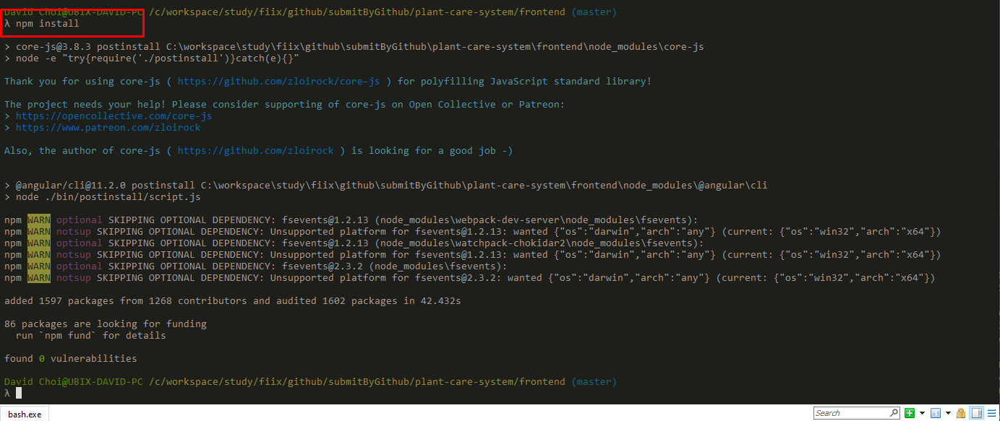
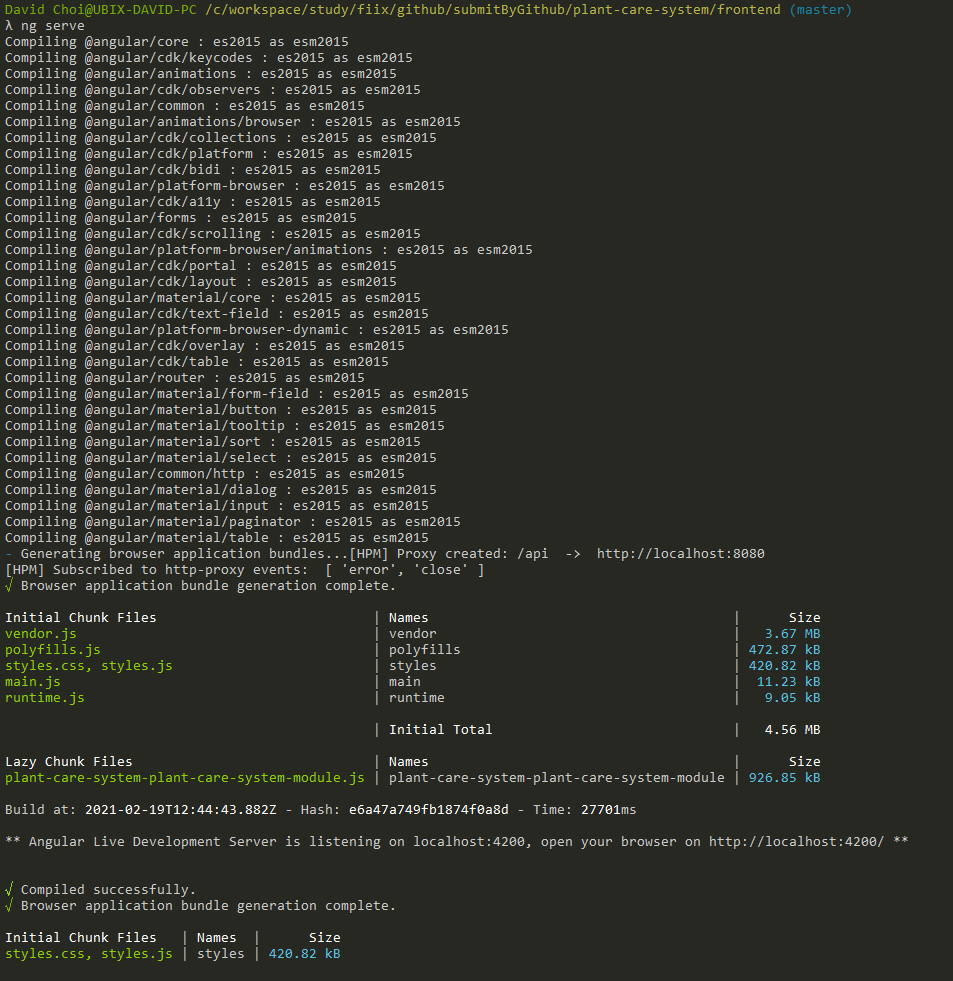

# plant-care-system

There are two directories which have frontend code and backend code. 

## backendAPI
`Spring Boot backend which provide API through 8080 port`

### How to run 
- **Step 1. h2 DB connection** 

- **Step 2. Run backend server with Spring Boot** 

## frontend
`SPA with Angular framework which provide UI side through 4200 port`

### How to run 
- **Step 1. npm install in command line under `frontend`**

- **Step 2. Run Angular CLI with `ng serve`**

- **Step 3. Open the browser with the address `http://localhost:4200/`**

## Web application result

