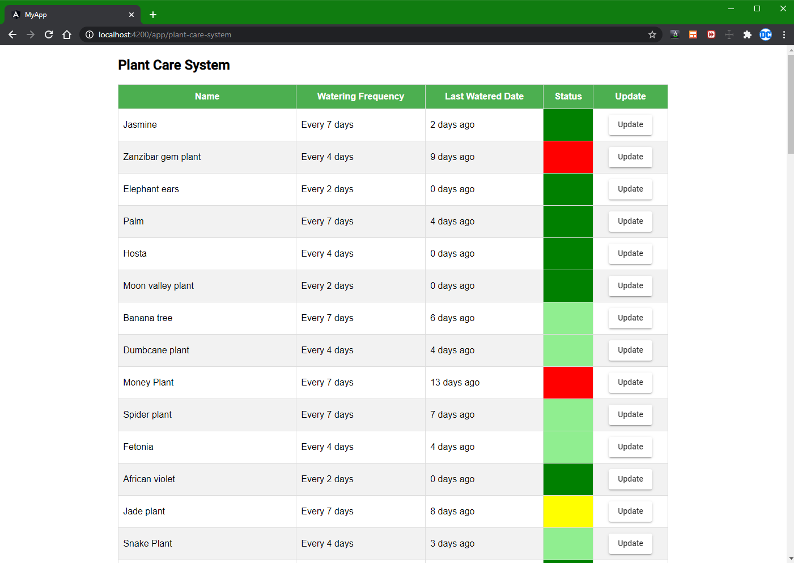
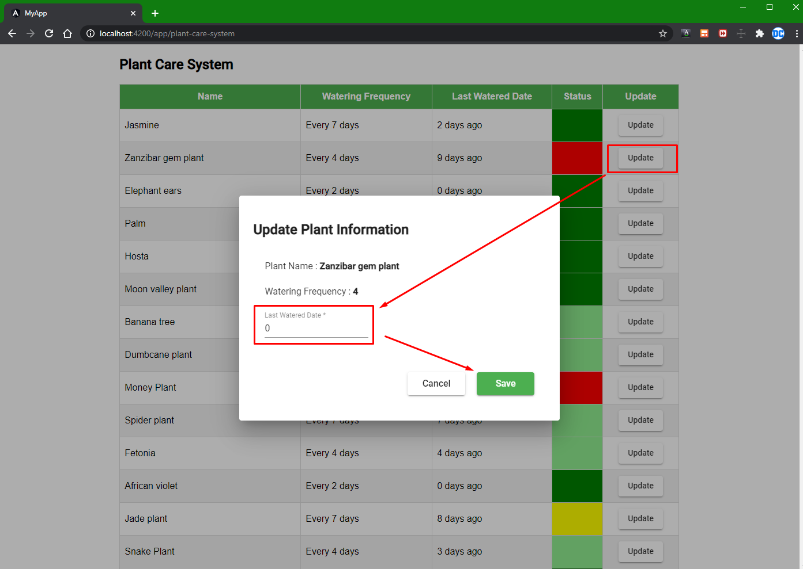
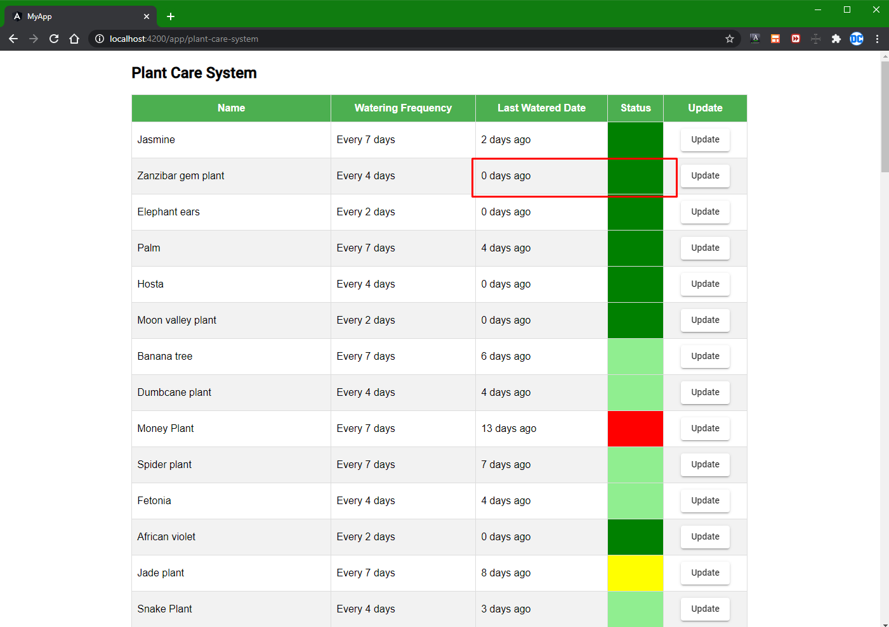

# plant-care-system

There are two directories which have frontend code and backend code. 

## backendAPI

`Spring Boot backend which provide API through 8080 port`

## frontend

`SPA with Angular framework which provide UI side through 4200 port`

## How to run 

Step 1. Run backend server with Spring Boot 

Step 2. Run Angular CLI in command line under `frontend` with `ng serve`
      
Step 3. Open the browser with the address `http://localhost:4200/`

